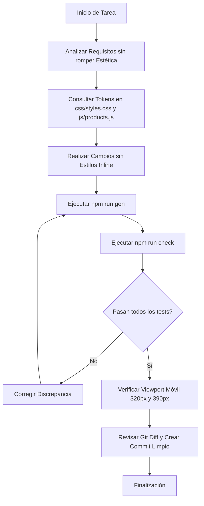

# Estándares de Diseño, Estética y Desarrollo para Agentes y Desarrolladores

> **Guía canónica de uniformidad visual, sistema de diseño y arquitectura de software para Chic & Love Ecuador.**
> Todos los agentes de IA y desarrolladores que interactúen con este repositorio deben seguir estos estándares de forma estricta e incondicional.

---

## 1. Filosofía y Dirección de Arte

El sitio web de **Chic & Love Ecuador** se rige por una estética **editorial, cálida, minimalista y dopaminérgica**:
- **Editorial y sofisticada:** Inspirada en editoriales de belleza y bienestar premium (rituales diarios, composiciones balanceadas, fotografía de producto limpia con fondos transparentes).
- **Cálida y orgánica:** Fondo tonal hueso/lino (`--paper`), superficies blanco roto suave (`--card`), tinta tipográfica profunda pero humana (`--ink`, `--ink-2`) y líneas casi imperceptibles (`--line`). Jamás fondos blancos clínicos fríos (`#ffffff` absoluto para el body) ni negros puros (`#000000`).
- **Dopaminérgica:** Colores vibrantes y alegres pero perfectamente controlados por fórmula (lavanda, rosa, verde manzana, celeste, magenta, azul rey). Gradiente insignia dopaminérgico (`--grad-dopamine`) para acentos sutiles de conversión.
- **Enfocada en conversión sin agresividad:** Jerarquía visual impecable, botones de píldora con micro-interacciones sutiles de elevación, badges claros de ahorro y checkout directo y humano a WhatsApp.

---

## 2. Tokens del Sistema de Diseño (Variables CSS Oficiales)

Todos los estilos visuales deben consumir exclusivamente las propiedades personalizadas definidas en `:root` dentro de `css/styles.css`. **Está terminantemente prohibido introducir colores, radios o sombras arbitrarias ad-hoc.**

### 2.1. Paleta Cromática y Neutros

```css
:root {
  /* Lienzo y Superficies */
  --paper: #f7f4ef;          /* Fondo editorial base del viewport y secciones */
  --card: #fffdfb;           /* Fondo de tarjetas, modales y contenedores elevados */

  /* Tipografía y Contraste */
  --ink: #111112;            /* Tinta principal: títulos, CTA primarios, textos destacados */
  --ink-2: #35312e;          /* Tinta secundaria: párrafos de lectura, subtítulos */
  --muted: #716a63;          /* Tinta terciaria: metadatos, disclaimers, kickers */
  --line: rgba(19, 19, 19, 0.09); /* Separadores sutiles, bordes suaves de tarjetas y botones */

  /* Acento Activo (se redefine contextualmente por producto) */
  --a: #8c6fc9;              /* Acento principal por defecto (lavanda) */
  --a-dark: #6a4fa8;         /* Acento oscuro para contraste de texto y estados hover */
  --a-soft: #f1ebfb;         /* Acento suave para fondos de etiquetas, píldoras y badges */

  /* Gradiente Dopamínico Insignia */
  --grad-dopamine: linear-gradient(
    90deg,
    #8c6fc9, #e88998, #35b34a, #4fa8d8, #b3538f, #2b4fc7, #8c6fc9
  );
}
```

### 2.2. Paleta Específica por Fórmula (Las 7 Fórmulas)

Cada producto tiene una identidad cromática única derivada de su presentación y empaque:

| Fórmula | Color Hex | Acento Soft | Acento Dark | Significado / Objetivo |
|---|---|---|---|---|
| **Hair & Nails Forte** | `#8c6fc9` (Lavanda) | `#f1ebfb` | `#6a4fa8` | Cabello y uñas, biotina |
| **Radiant Skin Vitamins** | `#f2a2ae` / `#e88998` (Rosa) | `#fdf0f2` | `#c66776` | Piel y colágeno |
| **Vinagre de Manzana ACV** | `#35b34a` (Verde) | `#eaf8ec` | `#238734` | Digestión y detox |
| **Sleep Vitamins** | `#4fa8d8` (Celeste) | `#ecf6fc` | `#2b7da8` | Sueño y melatonina |
| **Sexual Booster Women** | `#b3538f` (Magenta) | `#faedf5` | `#853065` | Vitalidad femenina |
| **Sexual Booster Men** | `#2e7fc2` (Teal / Azul) | `#eaf3fa` | `#1c5a8e` | Rendimiento masculino |
| **Anti-Stress Gummies** | `#2b4fc7` (Azul Rey) | `#eceffb` | `#1c3796` | Calma y ashwagandha |

### 2.3. Radios de Curvatura (`border-radius`)

```css
:root {
  --r-lg: 30px; /* Grandes contenedores, tarjetas de sección, hero cards */
  --r-md: 20px; /* Tarjetas de producto (.pcard), bloques intermedios, modales */
  --r-sm: 12px; /* Badges, píldoras, tags, selectores secundarios, inputs */
}
/* Botones de acción y chips de filtrado siempre usan píldora completa: border-radius: 999px; */
```

### 2.4. Sombras y Profundidad

```css
:root {
  --shadow-1: 0 10px 32px -24px rgba(17, 17, 18, 0.32); /* Elevación sutil en descanso */
  --shadow-2: 0 28px 70px -34px rgba(17, 17, 18, 0.36); /* Elevación en hover o tarjetas flotantes */
}
```

### 2.5. Tipografía y Fuentes

El sitio utiliza una **pila de fuentes nativa del sistema**, prescindiendo de peticiones externas (Google Fonts / Typekit) para garantizar un rendimiento instantáneo (LCP < 0.8s) y cumplir con la política estricta de seguridad (CSP sin orígenes externos):

```css
:root {
  --font-display: ui-rounded, "Avenir Next", "Segoe UI", system-ui, sans-serif;
  --font-body: system-ui, -apple-system, BlinkMacSystemFont, "Segoe UI", sans-serif;
  --header-h: 78px; /* Altura oficial de la barra de navegación */
}
```

- **Titulares (`h1`, `h2`, `h3`):** Se renderizan con `var(--font-display)`. Tienen peso `700` o `800`, tracking ligeramente compensado, y alturas de línea compactas (`line-height: 1.15` a `1.25`).
- **Cuerpo de texto (`body`, `p`):** Se renderizan con `var(--font-body)`. Peso regular `400` o semibold `600`, `line-height: 1.6`, tamaño base de `16px`.
- **Escalado fluido:** Uso de `clamp()` para transiciones naturales entre móvil y escritorio sin saltos abruptos (ej. `clamp(30px, 4.4vw, 46px)` para encabezados principales).

---

## 3. Guía de Componentes y Patrones UI

### 3.1. Botones (`.btn`)

Los botones deben mantener un aspecto consistente de píldora redondeada (`border-radius: 999px`), área de toque generosa (mínimo 44px de altura) y transiciones fluidas:

- `.btn-primary`: Fondo `var(--ink)` con texto blanco. Sombra sutil. En hover: `transform: translateY(-3px)` con elevación. En active: `transform: scale(0.97)`.
- `.btn-accent`: Fondo derivado de `var(--a-dark)`, texto blanco. Hover con halo de sombra tintado en `var(--a)`.
- `.btn-ghost`: Fondo transparente, borde de `1.5px solid var(--line)`. En hover: `border-color: var(--ink); transform: translateY(-2px);`.
- `.btn-white`: Fondo blanco puro `#ffffff` con texto `var(--ink)`, diseñado para destacar sobre fondos oscuros o bandas promocionales.
- `.btn-wide`: Modificador de ancho completo `width: 100%`.

### 3.2. Tarjetas de Producto (`.pcard`)

Las tarjetas de producto son el componente núcleo de conversión del sitio:
- **Contenedor:** Fondo `var(--card)`, borde `1px solid var(--line)`, radio `var(--r-md)`.
- **Imagen del frasco:** Imagen WebP centrada con fondo transparente. Al hacer hover en la tarjeta, la imagen experimenta una ligera elevación y micro-rotación (`transform: translateY(-6px) scale(1.03)`).
- **Kicker y Títulos:** Categoría/objetivo en tipografía compacta seguido de H3 con el nombre de la fórmula.
- **Claims y Beneficios:** Lista condensada de 2 a 3 activos clave en bullets limpios.
- **Precios:** Formato oficial con precio principal destacado en negrita. En promociones, el precio anterior se tacha con `<del>` y se acompaña de la píldora de ahorro (`.pcard-saving`) y la chapa superior (`.pcard-promo-tag`).
- **Estado de Promoción (`.is-promo`):** Acentúa el contorno de la tarjeta con el color activo del producto o gradiente correspondiente.

### 3.3. Cabecera y Navegación Sticky

- **Topbar:** Anuncio sutil superior con micro-separadores entre beneficios ("Envío gratis desde $49.99", "IVA incluido", "Distribuidor oficial").
- **Header Glassmorphism:** Fondo traslúcido con desenfoque de fondo (`backdrop-filter: blur(14px); background: rgba(247, 244, 239, 0.94);`).
- **Menú Móvil:** Drawer limpio accesible mediante `.nav-toggle` que bloquea el scroll del fondo agregando `.ui-locked` al `body`. Debe preservar contraste y accesibilidad con atributos `aria-expanded`.

### 3.4. Drawer del Carrito Lateral

- Carrito slide-over desde la derecha con persistencia sincronizada en `localStorage`.
- Selector dinámico de presentación (1 frasco, pack x2, pack x3) recalculando ahorros en tiempo real.
- Botón de checkout principal que genera la URL codificada de WhatsApp (`https://wa.me/593987591741?text=...`) con detalle exacto del pedido y desglose comercial.

### 3.5. Revelado Progresivo (`.reveal`)

- Todos los bloques principales de contenido integran la clase `.reveal`, que utiliza un `IntersectionObserver` centralizado para animar la opacidad y traslación vertical al hacer scroll.
- **Respeto a Accesibilidad:** Toda animación se desactiva bajo `@media (prefers-reduced-motion: reduce)`.

---

## 4. Estándares de Responsividad y Mobile-First

Chic & Love Ecuador recibe la gran mayoría de su tráfico desde dispositivos móviles (redes sociales y WhatsApp). Cualquier ajuste visual debe ser impecable en pantallas pequeñas.

### 4.1. Viewports Obligatorios de Verificación

1. **320px (Móvil Ultra-Compacto):** Viewport mínimo garantizado. Nada de textos recortados, botones fuera de pantalla ni superposiciones.
2. **390px (Móvil Estándar):** iPhone 12/13/14/15/16. Experiencia estándar del consumidor.
3. **768px (Tablet Portrait):** Ajuste de grillas de 1 a 2 columnas.
4. **1180px+ (Escritorio / Laptop):** Ancho máximo delimitado por el contenedor `.wrap` (`width: min(1180px, calc(100% - 48px)); margin-inline: auto`).

### 4.2. Regla Inquebrantable de Cero Desbordamiento Horizontal

Bajo ninguna resolución debe producirse scroll horizontal accidental:
```javascript
// Criterio de validación:
document.documentElement.scrollWidth - document.documentElement.clientWidth === 0
```
- Usar siempre `box-sizing: border-box`.
- Evitar anchos fijos en píxeles mayores a 280px (`width: 400px` ❌ -> `max-width: 100%` o `width: min(400px, 100%)` ✅).
- Usar `min-width: 0` en flex children para evitar que texto largo fuerce desbordamiento.
- Emplear `overflow-x: clip` en contenedores globales.

### 4.3. Zonas de Toque y Ergonomía

- Todos los elementos interactivos (botones, enlaces, selectores, chips) deben tener un tamaño táctil mínimo de **44 × 44 px**.
- Los botones principales en fichas de producto móviles deben quedar accesibles y cómodos para el pulgar.

---

## 5. Reglas Técnicas y Arquitectura Inquebrantable

Cualquier agente debe memorizar y acatar las siguientes restricciones de ingeniería del repositorio:

1. **Vanilla Puro Sin Dependencias de Terceros:**
   - No ejecutar jamás `npm install`.
   - No añadir dependencias de runtime, bundlers (Webpack, Vite), frameworks (React, Vue) ni librerías CSS externas (Tailwind, Bootstrap). Todo el código es HTML5, CSS3 moderno y JavaScript ESModules nativo para Node 20+.

2. **Fuente Única de Verdad Comercial (`js/products.js`):**
   - Precios, nombres de fórmulas, sabores, claims, colores, números de WhatsApp y textos legales se definen exclusivamente en `js/products.js`.
   - **Prohibido modificar precios o nombres en archivos HTML o Markdown a mano.**
   - Tras cualquier cambio en el catálogo, ejecutar `npm run gen` para regenerar los artefactos derivados.

3. **Cero Estilos Inline y Cero Scripts Inline:**
   - La Política de Seguridad de Contenido (CSP) **no** permite `'unsafe-inline'`.
   - Está prohibido escribir `<style>`, `<script>` inline o atributos `style="..."` en las etiquetas HTML. Toda variación estética se realiza mediante clases utilitarias en `css/styles.css` (ej. `.pt-0`, `.center-cta`, etc.).

4. **Sincronización Triple de la CSP:**
   - La cabecera CSP está duplicada exactamente en tres archivos:
     1. `_headers`
     2. `vercel.json`
     3. Etiqueta `<meta http-equiv="Content-Security-Policy">` de cada archivo HTML.
   - Si se requiere modificar la CSP, debe actualizarse en los tres lugares de manera idéntica. La suite de pruebas falla si existe la más mínima discrepancia.

5. **Token de Cache-Busting Sincronizado:**
   - Al editar `css/styles.css` o cualquier script en `js/`, debe incrementarse el token de versión `?v=AAAAMMDD-N` en **todas** las páginas HTML públicas de manera unificada.

6. **Lista Blanca del Build (`scripts/build.mjs`):**
   - El sitio se despliega desde `dist/`, generado por lista blanca estricta. Todo archivo nuevo destinado a producción (imágenes, documentos) debe registrarse en `scripts/build.mjs`.

7. **Gemelos Markdown y Negociación de Contenido:**
   - Cada página HTML pública tiene un gemelo Markdown idéntico en contenido textual (`<slug>.html` -> `<slug>.md`), enlazado en el `<head>` mediante `<link rel="alternate" type="text/markdown">`.
   - Los archivos generados por `npm run gen` (`llms.txt`, `catalog.json`, `agents.md`, `ingredientes.md`, `respuestas.md`) deben mantenerse perfectamente alineados con los datos del catálogo.

---

## 6. Integridad de Contenido, Mensajería y Cumplimiento Legal

1. **Declaraciones Médicas Prohibidas:**
   - Los productos son **complementos alimenticios**, no medicamentos.
   - Jamás utilizar verbos terapéuticos como "cura", "sana", "trata" o "elimina enfermedades".
   - Utilizar terminología adecuada: "contribuye al mantenimiento de...", "apoya el bienestar de...", "fórmula con activos reconocidos para...".
   - "FDA Registered" se refiere al registro del fabricante ante la FDA; la FDA **no** aprueba complementos alimenticios.

2. **Sin Reseñas Inventadas:**
   - No introducir esquemas `aggregateRating` ni contadores de valoraciones artificiales. Google sanciona el marcado estructurado fraudulento (*spammy structured markup*). Solo se publicarán cuando existan reseñas reales de clientes verificadas.

3. **Integridad de WhatsApp (`wa.me`):**
   - Las URLs de WhatsApp no deben incluir emojis ni caracteres especiales sin codificar, ya que la redirección de WhatsApp los corrompe en `U+FFFD`.

---

## 7. Protocolo de Trabajo y Checklist para Agentes

Antes de proponer o confirmar cualquier cambio en el repositorio, cada agente debe seguir rigurosamente este protocolo:



### Checklist Final Pre-Commit:
- [ ] ¿Los cambios respetan los colores, tipografía, radios y sombras de `css/styles.css`?
- [ ] ¿Se evitó cualquier estilo inline (`style="..."`) o script inline?
- [ ] ¿Si se tocó CSS o JS, se actualizó el token `?v=` en todos los HTMLs?
- [ ] ¿Si se tocó el catálogo `js/products.js`, se ejecutó `npm run gen`?
- [ ] ¿Se ejecutó `npm run check` y los 196+ tests de `node:test` pasan con éxito?
- [ ] ¿La interfaz móvil mantiene `scrollWidth === clientWidth` a 320px y 390px?
- [ ] ¿El diff de git contiene únicamente los archivos previstos sin residuos accidentales?
